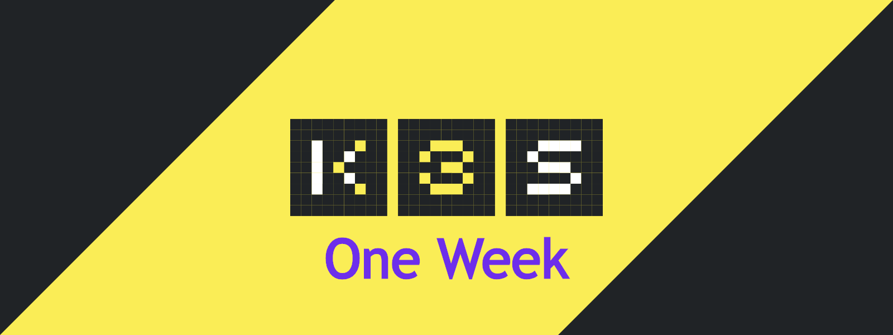

> K3S is five times eaiser than K8S 😊

<!--more-->

# 一周 K3S 学习心得

## 一点点历史
刚开始了解 K8S 是大约 1.4 版本 Beta 时（2016），[kubeadm](http://kubernetes.io/docs/getting-started-guides/kubeadm/) 刚开始有一定雏形，K8S 才开始在一般大众面前展露头角。

当时的 Docker 编排工具算是百花齐放，但当时如果想要玩好 K8S 是相当难的，因为 K8S 谷歌牵头开发，所有镜像都在 gcr 上，门槛已经算比较高了。而且部署用的工具也还相当不成熟，没有专业的运维部署都很难，况且还需要专人维护。

而今天，2020，K8S 已经有很多发行版了，大多编排平台底层如果不是基于 K8S 那也是支持 K8S。Rancher 1.0 转型到 2.0 时抛弃了之前的模式，选择了基于 K8S，Rancher 定位为集群管理。

因此 Rancher 之下诞生了很多辅助于 K8S 平台的工具和周边，K3S 也算是核心之一。

在这之前对于 K8S 仅限于了解，而现在则是需要考虑使用了，因此开始重新学习。

## 关于 K3S

K3S 大大降低了 K8S 的门槛，主要在于

* 单机可启动
* Docker 可启动
* 不再依赖 etcd

如果用不到集群，K3S+Dashboard 用来做单机的 Docker 界面都是非常合适的。

## 学习过程总结

### 理解 K3S
Kubernates 的核心是依赖 ETCD 作为核心状态存储，就好比 Hadoop 核心依赖 Zookeeper 一样，而 K3S 以 Adapter [kine](https://github.com/rancher/kine) 替代了对 etcd 的依赖，暴露 etcd 能力，但后端存储被适配到

* SQLite
* DQLite
* MySQL
* Postgres

在部署集群 K3S 时候只要选择的存储是网络数据库存储或者内嵌的 DQLite 即可。

K3S 是单独的可执行文件，将所需的大部分功能都打包到了内部

* k3s server - 主节点守护进程
* k3s agent - 从节点守护进程
* kubectl - 与 k8s 的交互工具
* crictl - containerd 调试工具

在启动 k3s 的 server 或 agent 时会通过容器（docker 或者 containerd）启动 K8S 的核心服务（例如 apiserver）。使得在部署 K3S 时异常简单，所有依赖都在一个二进制，也因为这样，支持 arm 也只需要再次进行编译单个的可执行文件即可（当然也要有容器镜像是支持对应架构的）。

不仅是简化了部署和集群一致性的依赖，K3S 针对部分核心服务有默认配置，并且提供了部分核心服务的实现

* servicelb - [rancher/klipper-lb](https://github.com/rancher/klipper-lb)
  * 提供最简化的 lb 实现 - 选择开放端口
* traefik
  * 提供 Ingress 和 LB
* [metric-server](https://github.com/kubernetes-sigs/metrics-server)
* cloud manager - K8S 能获取到节点信息
* corndns

K3S server/agent 相当于是 kubeadm + 部分控制器实现。

### 部署 K3S

官方给的部署就一行命令

```bash
curl -sfL https://get.k3s.io | sh -
```

拉取脚本并执行，但初次使用，还是建议自行手动部署，脚本简单明了，阅读后就知道[做了什么](https://wener.me/notes/devops/kubernetes/k3s#getk3sio)。

如果对于大批量部署，建议提前下载 k3s 然后上传启动即可。

### 部署选择

K8S 是分布式的 容器 编排工具，所有的功能都是围绕这个核心来展开的，因为分布式，那也必然面对着所有分布式平台都会面临的问题。

通常的单节点应用我们考虑的是

* CPU+内存 - 计算 - 基础资源
* 带宽 - 网络
* 磁盘 - 存储

在部署 Kubernates 的时候最开始也是考虑这些问题，K3S 的单节点部署能够把这些问题的思考时间滞后，但还是需要解决的。
并且部署的过程就是各种选择权衡的问题，再结合自身实际使用情况和资源硬件情况进行决策。

* 计算资源 - 阿里云、物理机、虚拟机
* 网络 - 如何组网
  * 跨网络
  * 混合网络
* 存储
* 容器运行环境 - docker、containerd
* cni
  * flannel 组网方式 - wireguard、host-gw、vxlan
  * calico
  * wave
  * 其他。。。
* servicelb - 内建、metallb
* ingress - traefik1（默认）、traefik2、nginx、haproxy、envoy、云平台提供
* K3S 存储后端 - Postgres、MySQL

目前有的人员、硬件资源、平台、已有环境

* 人员 - 1 个人 - 我
* 硬件
  * 1 服务器 - 40核 250G
  * 阿里云若干
  * 腾讯云若干
  * 小型物理机若干
  * 树莓派若干
* 平台
  * AMD64、ARM64
  * 阿里云、腾讯云
* 已有
  * Tinc

做了如下的规划部署

* 计算资源
  * 阿里云 - Bare Metal
  * 服务器开虚拟机 - libvirt+qemu+kvm
  * 物理机看情况开始虚拟机或直接使用
  * 树莓派直接安装
* 网络 - flannel-host-gw + tinc + metallb
  * 例如 10.10.0.0/16、其中 10.10.0.0/18 预留为宿主机、10.10.64.0/18 预留给 metallb 分配
* 存储 - zfs+longhorn
  * 选取部分节点
* 容器运行环境 - docker
* servicelb - metallb
* ingress - traefik2
  * 阿里云节点作为对外入口
* K3S 存储后端 - 阿里云 Postgres

部署完成后只是第一步，开始了解[各种概念](https://wener.me/notes/devops/kubernetes/k8s-glossary)部署各种服务适配各种场景才是更重要的。

## 是否应该选择 K3S

如果你犹豫使用 K3S 还是使用 K8S 请思考以下问题

* 公司在平台投入多少 ？
* 有多少专人维护 ？
  * K8S 建议至少 3-5 人
* 节点资源性能如何 ？
  * K8S 建议至少 8核32G - 否则基础服务占用资源不能被平摊
* 是否选择托管的 K8S ？
  * 不存在使用 K3S
* 混合云、私有云、公有云 ？

或者用最简单的方式判断

* 节点数 <=50 选择 K3S
  * 一人工作量
* 50 < 节点数 <= 150 选择 K3S 或 K8S
* 节点数量 > 150 选择 K8S
  * 有这样的规模，运维必然是一个团队，因此不存在 K8S 复杂的问题
